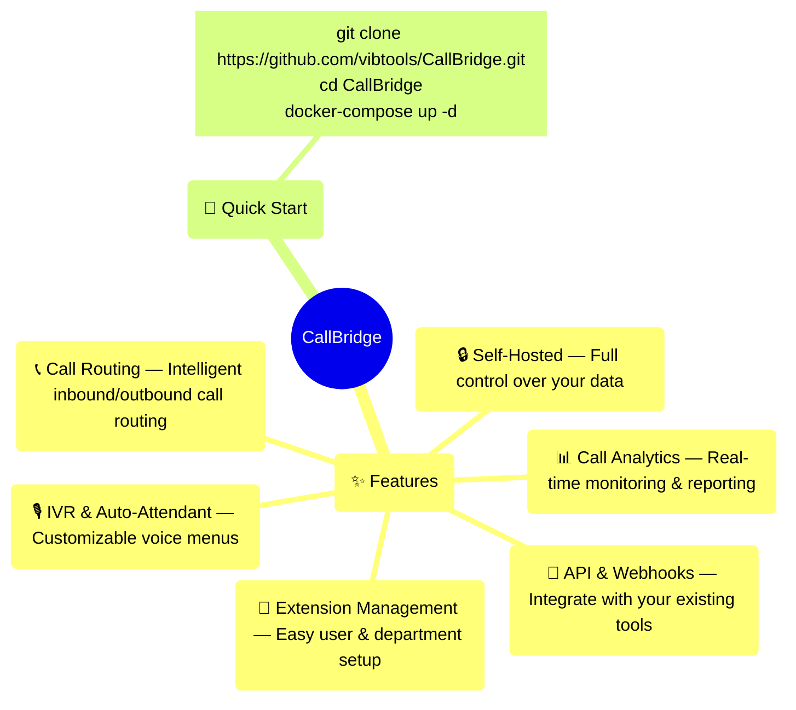

# CallBridge

**CallBridge** is an open-source, self-hosted PBX (Private Branch Exchange) system designed to simplify business communication. Built for flexibility and scale, it enables organizations to manage inbound/outbound calls, set up IVR menus, handle extensions, and integrate with CRMs — all without vendor lock-in.



---

## 📖 About CallBridge & Vib Tools

**CallBridge** is part of the [Vib Tools](https://vib.tools/) ecosystem, an organization dedicated to building **practical software for real workflows**. Designed as a high-performance, single-view UI dashboard for PBX operations, CallBridge provides operators with instant visibility into live calls, queues, and agent status.

Built with maintainability and developer-friendly architecture in mind, CallBridge leverages a modern React and Vite stack, following Vib Tools' commitment to open-source, inspectable software that solves real-world problems.

## 🏗️ Architecture & Tech Stack

CallBridge uses a modern, lightweight, and highly responsive technology stack:

- **Frontend Framework**: [React 19](https://react.dev/) with [Vite](https://vitejs.dev/)
- **Language**: [TypeScript](https://www.typescriptlang.org/) for strict type safety
- **Styling**: [Tailwind CSS v4](https://tailwindcss.com/) for utility-first styling
- **Components**: Customized [shadcn/ui](https://ui.shadcn.com/) patterns
- **Data Visualization**: [Recharts](https://recharts.org/) for call analytics and metrics

## 🗂️ Project Structure

This repository follows the **VibProject** template standard to ensure a clean boundary between source code, documentation, and operational scripts.

```text
.
├── .github/              GitHub repository configuration & templates
├── assets/               Static/public brand and project assets
├── config/               Project configuration
├── data/                 Mock/runtime data resources
├── docs/                 Public/user documentation
├── examples/             Public examples
├── scripts/              Project utility and verification scripts
├── src/                  React/Vite application source
│   ├── app/              Main application entry and routing
│   ├── components/       Reusable UI and layout components
│   ├── features/         Feature-specific page modules
│   ├── runtime/          Local PBX state simulator and sync logic
│   └── types/            TypeScript type definitions
└── tests/                Automated/static tests
```

### Responsibility Boundary
- **`src/`**: Application source code
- **`docs/`**: Public user documentation
- **`tests/`**: Contract and static validation

## 🤝 Contributing

We believe in building useful tools and sharing them openly. If you want to contribute to CallBridge:

1. Read our [Contributing Guidelines](CONTRIBUTING.md).
2. Check existing issues or open a new one before working on large features.
3. Submit a focused Pull Request with clear explanations.

## 🛡️ Security

We take security seriously. If you discover any security vulnerabilities or issues within CallBridge, please do NOT report them on the public issue tracker. Instead, follow our [Security Policy](SECURITY.md) and email us at:
📧 **[support@vib.tools](mailto:support@vib.tools)**

## 💬 Support & Contact

Need help or want to discuss a partnership?
- **Product & Technical Support**: [support@vib.tools](mailto:support@vib.tools)
- **General Inquiries & Partnerships**: [hello@vib.tools](mailto:hello@vib.tools)
- **Phone / WhatsApp**: +880 1795-470603 (Timezone: GMT+6)

Discover more practical software and desktop applications at **[Vib Tools](https://vib.tools/)**.

## 📄 License

This project is licensed under the terms of the MIT license. See the [LICENSE](LICENSE) file for details.